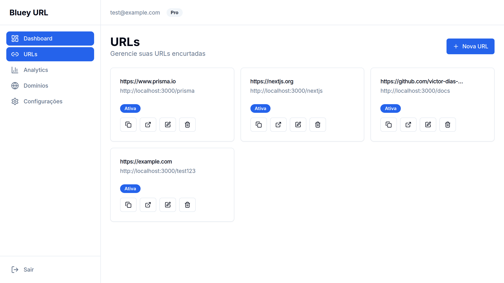
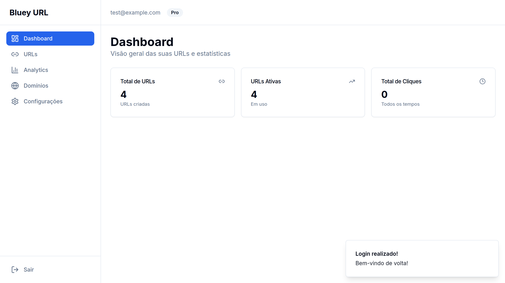
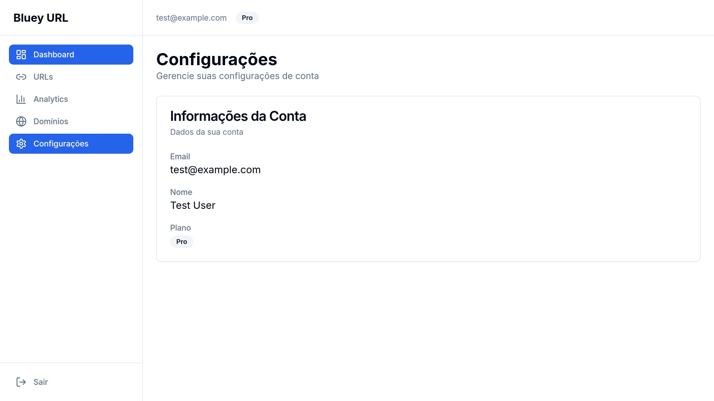

# Bluey URL

[English](README.md)

[](https://github.com/victor-dias-dev/bluey-url/actions/workflows/ci.yml)
[](LICENSE)

Encurtador de URL open source. O código curto resolve no Redis, cai para o PostgreSQL e redireciona com `301` ou `302`. Cada conta tem um painel para links, aliases e domínios próprios.

O código curto é único por domínio. O clique entra numa fila e não bloqueia o redirect. O worker que grava esses cliques, e a consulta DNS do domínio próprio, ainda estão abertos. Veja [ROADMAP.md](ROADMAP.md).





## O que o app cobre

- Cadastro, login e configurações da conta
- Links curtos, alias personalizado nos planos pagos, expiração e `301` / `302`
- Domínios próprios nos planos pagos
- Dashboard
- Endpoints de analytics para cliques, quando um worker persistir os eventos da fila

## Requisitos

- Node.js 20
- npm 10
- Docker e Docker Compose

## Como subir

```bash
npm install
docker compose -f docker-compose.dev.yml up -d
cp backend/env.docker.example backend/.env
cp frontend/.env.example frontend/.env.local
npm run prisma:generate
npm run prisma:migrate
npm run prisma:seed
```

Em dois terminais:

```bash
npm run dev:backend
npm run dev:frontend
```

O usuário de desenvolvimento é `test@example.com` / `password123`.

A API sobe em http://localhost:3000. Saúde: `GET /health`. O painel sobe em http://localhost:3001.

A API avisa em produção se `JWT_SECRET` ainda for um placeholder. Copie os exemplos e deixe segredo real fora do git.

| Variável                  | Função                                                     |
| ------------------------- | ---------------------------------------------------------- |
| `NODE_ENV`                | `development`, `test` ou `production`                      |
| `PORT`                    | Porta HTTP                                                 |
| `DATABASE_URL`            | PostgreSQL                                                 |
| `REDIS_URL`               | Redis                                                      |
| `JWT_SECRET`              | Segredo JWT                                                |
| `JWT_EXPIRES_IN`          | Validade do access token (`7d`, `1h`)                      |
| `CORS_ORIGIN`             | Origens permitidas (qualquer origem em desenvolvimento)   |
| `DOMAIN_AUTO_VERIFY`      | Pula o DNS na máquina local. Ignorado com `NODE_ENV=production` |

No painel, ajuste `NEXT_PUBLIC_API_URL` em `frontend/.env.local` quando a API não estiver em `http://localhost:3000`.

## Verificação

```bash
npm test
npm run lint
npm run typecheck
npm run build:backend
npm run build:frontend
```

## Repositório

```text
backend/     API Fastify, schema Prisma e regras de domínio
frontend/    Painel em Next.js
docs/        Arquitetura, regras de negócio e prints
```

Caminho do redirect: [docs/architecture.md](docs/architecture.md). Regras e o que já vale hoje: [docs/business-rules.md](docs/business-rules.md). Docker: [DOCKER.md](DOCKER.md).

## Contribuição

Veja [CONTRIBUTING.md](CONTRIBUTING.md). Falha de segurança entra pelo [reporte privado](https://github.com/victor-dias-dev/bluey-url/security/advisories/new), descrito em [SECURITY.md](SECURITY.md).

Licença [MIT](LICENSE).
